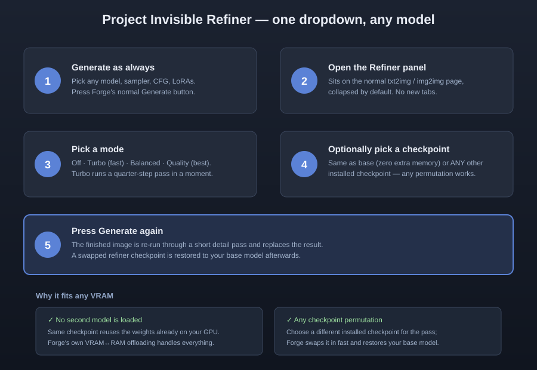

# Project Invisible — Refiner for Forge Neo

**A second detail pass for ANY checkpoint Forge can load — without a separate tab, extra downloads or a Forge core fork.**

[Installation](#beginner-installation) · [Usage](#step-by-step-usage) · [Philosophy](#the-project-invisible-philosophy) · [Troubleshooting](#troubleshooting-and-support)

> This is my first public project and I am still learning. Please forgive any mistakes or rough edges. Kind, complete bug reports will help improve the project for everyone.

## Short description

Unofficial Forge Neo extension that adds an optional second detail pass to the normal Generate workflow — for any checkpoint, any quantization, any VRAM size — without a separate tab, extra virtual environment or Forge core fork.

## Project overview

Project Invisible — Refiner is an independent Forge Neo extension created to make a common generation wish — "polish the finished image a little more" — feel like a natural part of the existing WebUI.

The basic idea is simple: generate as you always do, open the small Refiner panel, pick a mode and press the usual Generate button again. The extension performs the second pass behind the existing workflow instead of asking users to learn a separate refinement tool or workflow.

This is the author's first public project. It was built by a beginner who is still learning. Mistakes may exist, and patience is sincerely appreciated. Clear reports and complete error messages will help the project improve.

## The Project Invisible philosophy

"Invisible" means integration with minimum disruption.

The extension is designed around these principles:

- use Forge Neo's normal interface and Generate button;
- avoid adding a separate generation tab;
- avoid requiring another virtual environment;
- avoid modifying or forking Forge core files;
- work with the checkpoint that is already loaded by default — zero extra model memory;
- allow any checkpoint permutation: the same checkpoint, or any other installed checkpoint, with Forge's own loader swapping and restoring it;
- show refiner controls only as a small, collapsed panel on the normal page;
- leave unrelated models and extensions unchanged;
- make errors, experimental behavior and quality trade-offs visible and honest.

The extension is "invisible" in workflow, not in responsibility. It should never hide errors, limitations or quality trade-offs from the user.

## Testing status

The second pass has been tested and worked on the author's computer with local checkpoints through the normal txt2img flow.

Other model architectures, quantizations and hardware combinations are untested or not fully confirmed. The code is written so that ANY checkpoint Forge loads can be refined — that is a design property, not a tested claim for every setup. Performance, memory use and compatibility vary with the GPU, driver, PyTorch build, Forge version, selected model files, resolution and enabled options. No claim is made that every NVIDIA or AMD configuration will work.

## Main behavior

After a normal generation finishes, the extension takes each finished sample and runs it back through Forge's own img2img machinery with a small denoising strength, a reduced step count, and the same (or your chosen) checkpoint. Because the second pass is an ordinary Forge job, every sampler, scheduler, CFG value, LoRA and preset combination the base run could use works unchanged.

The implementation does not modify Forge core files. Setting the mode back to **Off** restores stock behavior immediately.

## Memory management

- **Default (same checkpoint):** no additional model is ever loaded. The pass reuses the weights already on your GPU, whatever their quantization (bf16, fp8, int8, and everything else Forge loads).
- **Different checkpoint:** Forge's own model loader swaps the chosen checkpoint in for the pass and restores your base model afterwards. The swap speed and VRAM/RAM handoff are exactly what Forge itself provides.
- Forge's memory management, offloading and streaming apply to the pass as they would to any normal generation. These are best-effort safeguards, not guarantees — a large model can still exceed available GPU memory or system RAM.

## Speed modes

| Mode | Denoise | Steps | Notes |
|---|---|---|---|
| Turbo (fast) | 0.25 | ¼ of your steps | Fastest; forces CFG 1 for the pass |
| Balanced | 0.35 | ½ of your steps | Middle ground |
| Quality (best) | 0.5 | your full steps | Strongest polish, keeps your CFG |

Turbo adds only a moment per image; Quality adds roughly one extra pass.

## Image honesty

The second pass re-renders pixels at low denoise. Extremely fine text can shift slightly — use Turbo for the smallest change. The extension records `Refiner: <mode>` in the refined image's PNG info so refined results are always identifiable. If the pass fails for any reason, the base image is kept and the reason is logged to the terminal with a `[PI-Refiner]` prefix.

The refiner is a targeted detail pass, not a general image enhancer. It cannot repair anatomy, composition, lighting, identity or weaknesses already present in the generated image.

## Step-by-step usage

1. **Generate as always** — pick your model, sampler, CFG, LoRAs; press Generate.
2. **Open the Refiner panel** — it sits on the normal txt2img/img2img page, collapsed by default.
3. **Pick a mode** — Off (default), Turbo, Balanced, or Quality.
4. **(Optional) Pick a refiner checkpoint** — *Same as base* (default) or any other installed checkpoint. Any permutation is possible.
5. **Press Generate again** — the finished image is re-run through the detail pass and replaces the result.

## Beginner installation

1. Stop Forge completely.
2. Choose **one** way — never both: **Install from URL** with this repository's URL, or **Download ZIP** and extract into `sd-webui-forge-classic/extensions/`.
3. Avoid double nesting. The correct path ends with: `extensions/<folder>/scripts/engine.py`.
4. Start Forge normally. No extra dependencies are installed.
5. Refresh your browser with **Ctrl+F5** after updates.

## Troubleshooting and support

If a problem occurs, open a GitHub issue and paste the complete error from the DOS/terminal window. The report must begin at the first error line and continue through the final traceback line. A single final sentence is usually not enough to identify the cause.

Reports should also include:

- Windows and Forge Neo versions;
- GPU, VRAM and system RAM;
- base and refiner checkpoint filenames;
- resolution and sampling steps;
- whether Save GPU memory / offloading was enabled;
- the selected Refiner mode and checkpoint;
- exact reproduction steps.

Private usernames, paths, prompts, tokens and images should be removed before posting publicly.

Users may also paste the complete error into ChatGPT, Claude, Gemini or Grok and ask for a beginner-friendly explanation.

## Contributions

Bug reports, documentation corrections and focused code improvements are welcome. Contributors should state exactly what was tested, avoid describing untested modes as working, preserve upstream licenses and never commit model weights, generated images, dependency folders, logs, access tokens or private information.

## License and independence

This extension is independent and unofficial. It is not an official product of any model vendor or of Forge. The repository does not relicense model weights; every model keeps its own license. Extension code: [Apache License 2.0](LICENSE).

## A humble note from the author

This is a first public attempt by a non-programmer learning through experimentation and community help. Please forgive mistakes. Constructive feedback, patient explanations and complete error reports are welcomed with gratitude.

## Special thanks

Special thanks to u/malcolmrey and the r/malcolmrey community for support and inspiration.

Thanks also to the Forge Neo, Diffusers, Qwen, DeGrid, Spectrum and wider open-source communities whose work made this project possible.

If you contribute, test, or report issues and would like to be named here, say so and you will be added.
